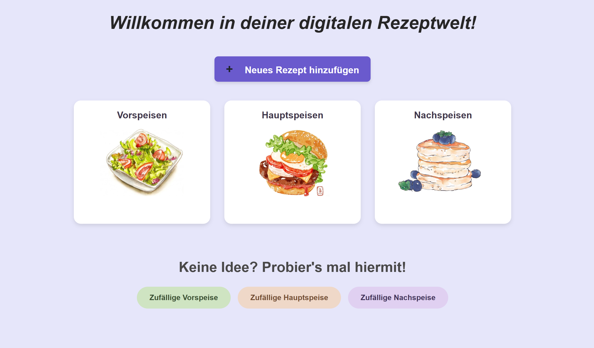
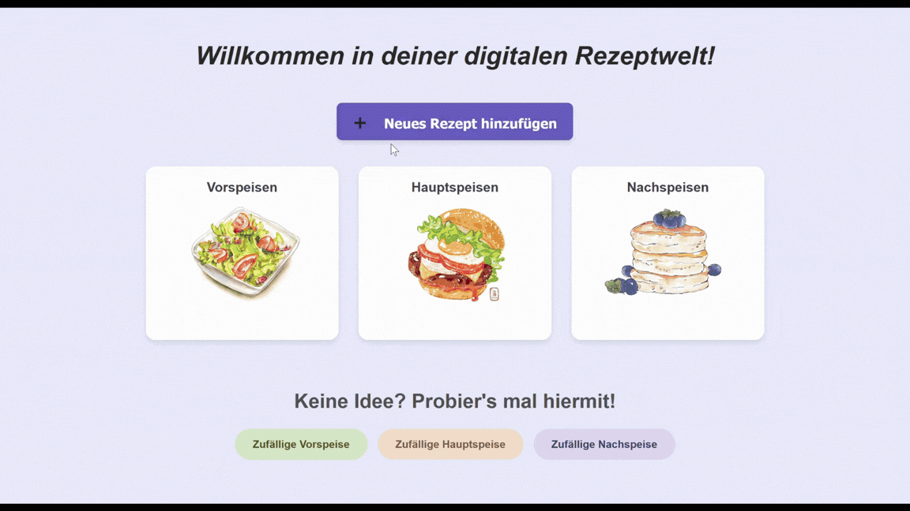
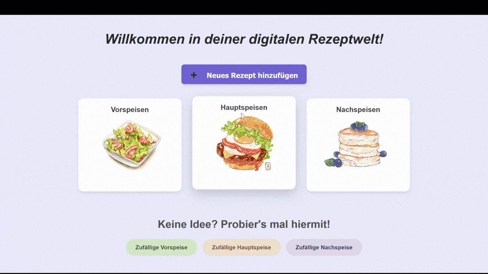
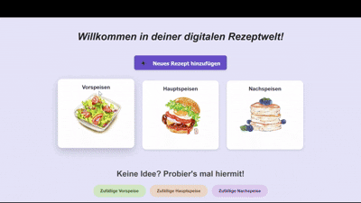
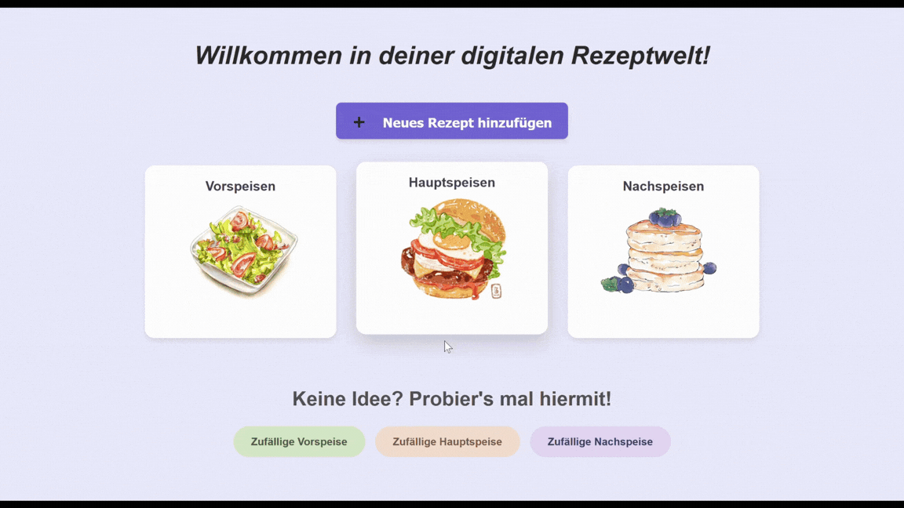
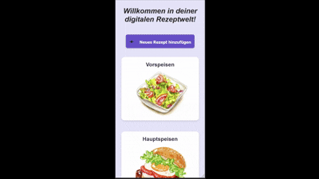

# Rezept Welt

<p align="left">
  
  
  
  
  
</p>

## Full-stack web application to manage your own recipe ideas.

Rezept Welt brings structure to cooking ideas. Users can add their own recipes with ingredients, categories, preparation instructions, and images, and later search and filter them to quickly find exactly what they are looking for — whether by name or ingredients.

--- 

## Get started
Follow these steps to start the project in your local environment (e.g., WSL or Linux). 

### 1. Requirements 
* **Java 21** (JDK)
* **Docker & Docker Desktop**
    
### 2. Start Docker 
Start the PostgreSQL database via Docker Compose: 
```bash
export $(cat .env.example | xargs)
docker compose up -d
```
### 3. Start application 
Start the application with the Gradle wrapper: 
```bash
./gradlew bootRun
```

Once the startup process is complete, you can access the application at: 
```bash
http://localhost:8080
```

---

## Features & Demo
### User Features

<table>
  <tr>
    <td align="center"><b>Categorization: Recipes are sorted into `Vorspeisen`, `Hauptspeisen`, and `Nachspeisen` for quick access</b></td>
  </tr>
  <tr>
    <td></td>
  </tr>
  <tr>
    <td align="center"><b>Recipe Management: Add, view, and organize your favorite recipes.</b></td>
  </tr>
  <tr>
    <td></td>
  </tr> 
 <tr>
    <td align="center"><b>Visual Appeal: Upload and display images for every recipe.</b></td>
  </tr>
  <tr>
    <td></td>
  </tr>
  <tr>
    <td align="center"><b>Smart Search: Filtering to find specific recipes by name or ingredients.</b></td>
  </tr>
  <tr>
    <td></td>
  </tr> 
  <tr>
    <td align="center"><b>Random Recipe Generator: Get inspired! Use the category-specific `random buttons` to pick a next meal.</b></td>
  </tr>
  <tr>
    <td></td>
  </tr>
  <tr>
    <td align="center"><b>NEW FEATURE: Now optimized for mobile phones.</b></td>
  </tr>
  <tr>
    <td></td>
  </tr> 
</table>

---

### Technical Highlights
- Clean Code: Focused on readability, maintainability, and SOLID principles.
- Persistence: Robust data handling using Spring Data JDBC and PostgreSQL.
- Database Migrations: Version-controlled database schema using Flyway.
- Responsive Design: A fully responsive web interface (Thymeleaf & CSS).
- Testing Culture: Unit tests (JUnit 5, AssertJ) to ensure high code quality.
  
---

## Tech Stack 

### Backend
     

### Frontend
  

### Database
<p align="left">

</p>

### Testing Strategy
<p align="left">
  
</p>

--- 

### What I learned 
- Independetly implementing a webapplication in a test-driven manner. In doing so, I consolidated the knowledge I had gained during my studies and practiced solving problems.
- Database Migrations: I implemented Flyway to manage database schema changes version by version, avoiding the "it works on my machine" problem with manual SQL scripts.
- Binary Data (BLOBs): Dealing with BYTEA in PostgreSQL taught me how to efficiently handle image uploads and convert binary data to Base64 for display in the frontend.
- Testing Strategies: By using Spring Profiles (@Profile("!test")), I learned how to isolate production code (like data loaders) from the test environment to ensure reliable and repeatable tests.
- Thymeleaf Templating: I deepened my knowledge of how to pass complex objects from a Spring controller to a dynamic HTML view and handle conditional rendering.

--- 

## Images

This project uses graphics from external providers. The rights belong to the respective authors:

* **Logo (Rezept Welt)**: [Flaticon.com](https://www.google.com/url?sa=t&source=web&rct=j&url=https%3A%2F%2Fwww.flaticon.com%2Ffree-icon%2Frecipe-book_1397179&ved=0CBUQjRxqFwoTCIjSzaDPypIDFQAAAAAdAAAAABAQ&opi=89978449)
* **Appetizer**: Created via [Doodlewash.com](https://www.google.com/url?sa=t&source=web&rct=j&url=https%3A%2F%2Fdoodlewash.com%2Feating-leaves-again%2F&ved=0CBUQjRxqFwoTCODJocW8ypIDFQAAAAAdAAAAABAP&opi=89978449)
* **Main course**: [Pinterest](https://www.google.com/url?sa=t&source=web&rct=j&url=https%3A%2F%2Fwww.pinterest.com%2Fpin%2F2814818500241359%2F&ved=0CBUQjRxqFwoTCOCOudPOypIDFQAAAAAdAAAAABAQ&opi=89978449)
* **Dessert**: [Pinterest](https://www.google.com/url?sa=t&source=web&rct=j&url=https%3A%2F%2Fwww.pinterest.com%2Fpin%2F2814818500241359%2F&ved=0CBUQjRxqFwoTCOCOudPOypIDFQAAAAAdAAAAABAQ&opi=89978449)
* **Guacamole**: [Eat.de](https://eat.de/wp-content/uploads/2025/09/puking-pumpkin-halloween-nachos-8389.jpg)
* **Salad**: [Eat.de](https://eat.de/wp-content/uploads/2023/04/caesar-salad-0369.jpg)
* **Vanillepudding**: [Giallozafferano.de](https://www.google.com/imgres?q=vanillepudding&imgurl=https%3A%2F%2Fwww.giallozafferano.de%2Fimages%2F112-11286%2Fvanilla-pudding_1200x800.jpg&imgrefurl=https%3A%2F%2Fwww.giallozafferano.de%2Frezepte%2Fvanilla-pudding.html&docid=2BXIqCJv3cTuFM&tbnid=u-HisKfnYsKddM&vet=12ahUKEwjMy8T3iOaSAxUq9bsIHV2hALkQnPAOegQITxAB..i&w=1200&h=800&hcb=2&ved=2ahUKEwjMy8T3iOaSAxUq9bsIHV2hALkQnPAOegQITxAB)
* **Salmon**: [Essen-wissen.de](https://www.google.com/imgres?q=gebratenes%20lachsfilte&imgurl=https%3A%2F%2Fessen-wissen.de%2Fwp-content%2Fuploads%2F2021%2F10%2Flachs-kartoffelbrei-adobestock-143854337-2-scaled.jpeg&imgrefurl=https%3A%2F%2Fessen-wissen.de%2Frezept%2Fgebratener-lachs-mit-pastinakenpueree-und-meerrettichschaum%2F&docid=Wk8cIPzP3OJnQM&tbnid=C6y35Ha293w8gM&vet=12ahUKEwi926nVieaSAxXT87sIHSeSDcYQnPAOegQIKBAB..i&w=2560&h=1440&hcb=2&ved=2ahUKEwi926nVieaSAxXT87sIHSeSDcYQnPAOegQIKBAB)

